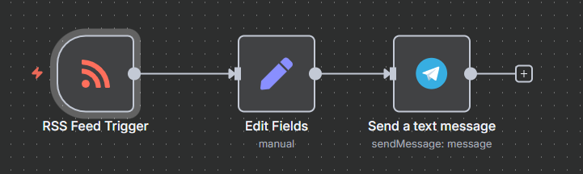
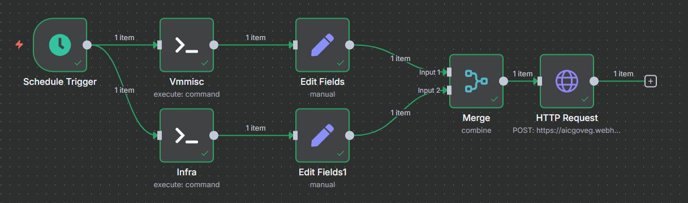
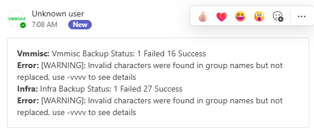

# N8N

* This repo will be kept being updated for my future workflows 
## Initializing the App
I used to run apps on prem so I used docker compose to run my n8n locally, it also gets me some experiance by taking some extra considerations in general.

In this case we need to set this i needed to set
`- GENERIC_TIMEZONE=Africa/Cairo` environment variable for africa cairo my current zone.

```bash
docker compose up -d
```

## Create your feeds workflow

I needed to create a workflow to get me feed from a specific playlist in a youtube channel so i had to deal with etching the feed and send it over chatbot on telegram.

The playlist doesn't have a ready feeds link by default, so i had to use an external assistant in this task which is rss.app

To get the feeds: goto rss.app > copy past the playlist link to create a rss feed.

To create a bot follow the recommended [docs](https://docs.n8n.io/integrations/builtin/credentials/telegram/#related-resources) it's easy in

to send the feed to your chatbot you need to get the channel id as follows:

1- type this url in browser: https://api.telegram.org/bot<YOUR_BOT_TOKEN>/getUpdates

2- send a message to the bot

3- refresh the page

4- get the chat id

this is screen of my workflow:


## Check veeam back WF
I'm using it to do a schedule chak for my veeam backup of my servers using schedule trigger and exect shell on my machine to run the check command, I used my ssh key for auth. and it sends my a http request on team using team webhook





